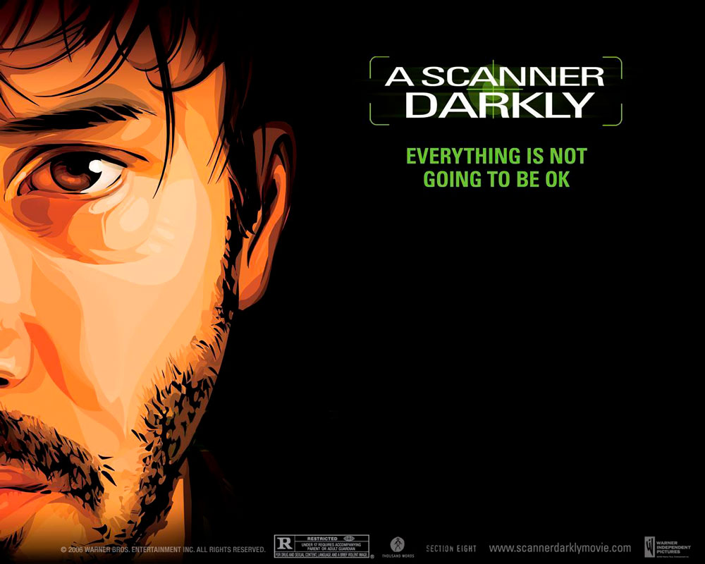
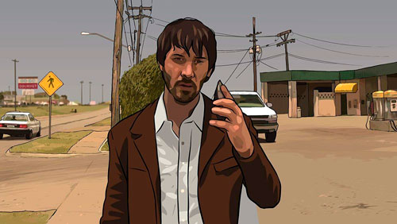
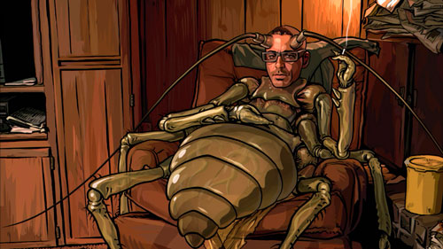
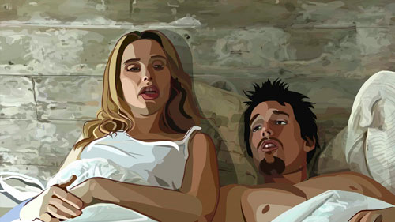
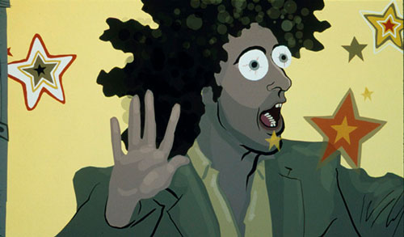
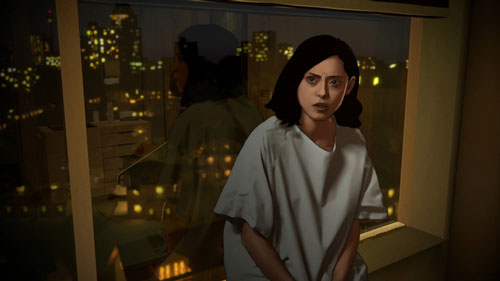
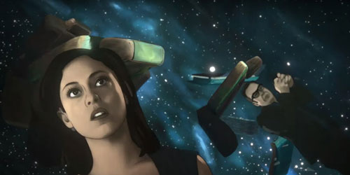
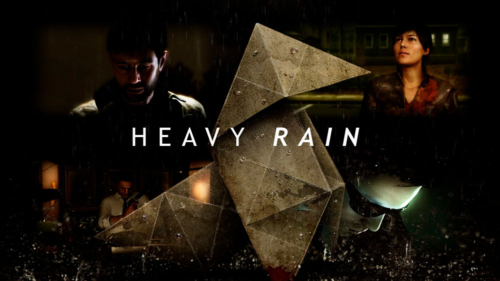

# PEC3: Visionando el futuro con las gafas de Manovich: redescubriendo la hibridación
\
*Autor:* Manuel Bayonas Martínez

*Fecha:* 21/12/22

 - **A Scanner Darkly**: Hibridación entre cine tradicional e ilustración.
 - **Heavy Rain**: Hibridación entre cine y videojuegos.
\
\
## A Scanner Darkly: Hibridación entre cine tradicional e ilustración

> Todos seremos transformados, siguió pensando tristemente, porque ahora
> mismo estamos jodidamente invertidos.
> *Una mirada a la oscuridad*, **Phillip K. Dick**
\

*A Scanner Darkly © Warner Bros Entertainment Inc.*  
\
\
La cinematografía se basa en la creación de secuencias de imágenes que simulan movimiento. Bien sea mediante el uso de cámaras analógicas o digitales, el cine es principalmente un medio fotográfico. Sin embargo, podemos encontrar casos de hibridación entre el medio cinematográfico y la ilustración. Un ejemplo significativo es la película *A Scanner Darkly* (Richard Linklater, 2006), filmada digitalmente y posteriormente ilustrada mediante **rotoscopia interpolada**. Mediante la hibridación, la película comunica de forma efectiva la narrativa distópica y fantástica de la novela original de Philip K. Dick, ambientada en una subcultura de las drogas, que juega con los binomios realidad y delirio, luz y oscuridad, vida y muerte.
\
### Primeras hibridaciones cinematográficas

Hoy en día, la hibridación en cinematografía es la norma, mientras que cualquier estilo singular de creación - acción en vivo, ilustración, animación digital, fotograma a fotograma, etc.- es excepcional. Sin embargo, los primeros ejemplos de hibridación eran una especie de collage en el que las diferentes técnicas utilizadas eran evidentes a simple vista. La fusión de medios se perfecciona por primera vez en la película Matrix (Lilly y Lana Wachowski, 1999), en la que es imposible distinguir entre las escenas filmadas y las generadas por ordenador. Es en este momento cuando se puede hablar de “una nueva especie, un nuevo tipo de estética visual que no existía previamente” (Manovich, 2007).
\
### La visión de Linklater

Se propone que la película A Scanner Darkly supone un hito similar de la hibridación cinematográfica. En este caso, mediante la fusión de la fotografía y la ilustración creada por rotoscopia. Esta técnica se remonta a los inicios del cine, cuando se utilizaba para trazar secuencias de acción en vivo, proyectadas fotograma a fotograma sobre papel, como referencia del movimiento para los animadores. En 1919, se publicó el primer personaje de dibujos animados creado por rotoscopia, ‘Koko el payaso’, de Max Fleischer. Un siglo más tarde, esta labor se realiza de forma digital utilizando programas informáticos como Nuke, Silhouette o After Effects (Reinares y Torres, 2019).

En la obra de Linklater, todas las escenas fueron filmadas como acción real y después ilustradas con técnicas de rotoscopia. Así, el resultado final es una cinta de animación que mantiene la narrativa y el impacto visual de un ‘action film’, con una estética coherente de novela gráfica. La justificación de la hibridación mediática en este film es comunicar al espectador la fragilidad de la vida y el horror de la locura provocadas por el consumo de drogas. Después de todo, la historia original de Phillip K. Dick habla de la oscuridad, una temática difícilmente expresada mediante la fotografía que se basa, precisamente, en la luz. Por el mismo motivo, Loving Vincent (Dorota Kobiela y Hugh Welchman, 2017) utiliza la hibridación de la cinematografía y la pintura al óleo para transportarnos al universo del genio del postimpresionismo. La película se filmó con actores, pero el metraje final se compuso con 64.000 fotogramas pintados sobre lienzo (Mackiewicz y Melendez, 2016).

El hecho de que distintos medios tengan un punto de encuentro en común, el software digital, hace posible lo que Manovich denomina una “remixabilidad profunda”, esencia de la “revolución híbrida”, que surge no solo por un producto final distintivo sino, también, por la fusión de distintas técnicas. Así, la cinematografía, la animación, los efectos especiales, el diseño gráfico, etc. conforman un nuevo metamedio.
\
### Otros ejemplos del híbrido cine-ilustración

Linklater ya había experimentado con las técnicas de rotoscopia en su película Waking Life (2001). El resultado de este film se acerca mucho a la hibridación de la que habla Manovich, pero no llega a ser una fusión indistinguible de medios como en su obra de 2006. Otro ejemplo más reciente de hibridación entre cinematografía e ilustración es la serie Undone (Hisko Hulsing, 2019). En los tres casos, se hace evidente que la hibridación del cine tradicional y la ilustración es un modo idóneo de crear una narrativa onírica, distorsionada y extravagante, pero al mismo tiempo profundamente ligada a la realidad, algo que sería más difícil plasmar de manera convincente utilizando sólo una de estas técnicas.
\
#### Tabla comparativa de imágens que pretenden ser más realistas en contraposición a las que tienen un carácter onírico y distorsionado
|Imágenes realistas|Imágenes oníricas|
|---|---|
| *A Scanner Darkly © Warner Bros Entertainment Inc.*| *A Scanner Darkly © Warner Bros Entertainment Inc.*|
|*Waking Life © 20th Century Fox Film Corp.*|*Waking Life © 20th Century Fox Film Corp.*|
|*Undone © Amazon Studios*|*Undone © Amazon Studios*|

***
***
## Heavy Rain: Hibridación entre cine y videojuegos

>A glimpse into the world proves that horror is nothing other than reality.
>**Alfred Hitchcock**

*Heavy Rain © 2022 Quantic Dream*

En el punto de intersección entre el ordenador, la televisión y el entretenimiento interactivo, encontramos el nacimiento de los videojuegos. Su desarrollo comienza a finales de la década de 1970, cuando el ordenador evoluciona como metamedio después de su primera fase de invención e implantación práctica (Manovich, 2013). La primera videoconsola surgió del reto de construir “la televisión perfecta”. Según la visión del ingeniero a cargo de este proyecto, Ralph Baer (1922-2014), este producto debía incluir necesariamente alguna función interactiva. Fruto de su trabajo, en 1972 se empezó a fabricar la Magnavox Odyssey, conocida como ‘la caja marrón’, un diseño sencillo de cuarenta transistores y cuarenta diodos para generar señales simples en la televisión (Baer y Hui, 2019). No tenía sonido y, para llevar la cuenta de las partidas de sus muy rudimentarios juegos, había que usar lápiz y papel. Una serie de accesorios periféricos e impresos acompañaban a la videoconsola, que fue un éxito de ventas. 

En las siguientes décadas, la tecnología permitiría la creación de formas de videojuego más sofisticadas, con color, sonido, memoria, distintas dimensiones de movimiento, portabilidad, comunidades online o realidad virtual. Porque la industria del videojuego nunca ha sido ajena al contexto tecnológico. Muy al contrario, se encuentra a la vanguardia de la experimentación en la hibridación de medios devenida en la era digital. En muchas ocasiones, esta hibridación viene motivada por el modo de juego y la narrativa de las distintas propuestas. Se propone que un punto de inflexión en esta historia de la innovación mediática es Heavy Rain (David Gage y Steve Kniebihly, 2010), un híbrido entre el cine y el videojuego, una forma de hiper vídeo interactivo que sitúa al jugador en el papel del protagonista utilizando el lenguaje audiovisual del cine, mediante una cadena no lineal de escenas navegables (Manovich, 2007).

Heavy Rain está basado en un guión de 2.000 páginas y se engloba en la categoría de dramas interactivos y aventuras de acción. A lo largo del desarrollo de la trama, el jugador controla a cuatro personajes desde una perspectiva de tercera persona y las acciones del jugador definen el desarrollo de distintas líneas argumentales que culminan en finales alternativos. Durante el proceso de producción del juego, se utilizaron técnicas de captura de movimiento, ahora convencionales en cinematografía para crear efectos especiales, empleando a más de 130 actores y actrices trabajando en sesenta localizaciones distintas.  El equipo de diseño en 3D generó 30.000 animaciones. La banda sonora, de 300 pistas, compuesta por Normand Corbel, emplea el piano, una orquesta de cámara y una orquesta sinfónica. 

Respecto al guión, está estructurado como en un psicothriller, un subgénero que trata de las conductas patológicas dentro de un contexto criminal (González, 2002). En la introducción, conocemos al protagonista, Ethan Mars, superviviente de un accidente de coche que mató a uno de sus dos hijos. Años después, un asesino en serie secuestra a su otro hijo y, en base a las investigaciones en curso, el niño morirá dentro de tres días. Mars recibe varias figuras de origami con instrucciones para completar una serie de pruebas con las que debe demostrar al asesino cuánto le importa su hijo. 

La narrativa audiovisual utiliza recursos de composición y movimientos de cámara del cine durante las secuencias de animación pero también en los momentos en que el jugador debe participar en la acción. Antecedentes del género de los videojuegos de ‘survival horror’ como Alone in the Dark (Frédérick Raynal, 1992) o Silent Hill (Keiichiro Toyama, 1999) no habían conseguido mantener el lenguaje cinematográfico durante las secuencias de acción.
